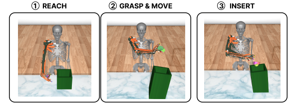

# MyoChallenge 2023 - Team Lattice

This is the repository of the winning solution to the [MyoChallenge 2023](https://sites.google.com/view/myosuite/myochallenge/myochallenge-2023) (object manipulation track) by team Lattice. Our team is named after the exploration method for high-dimensional environments, Lattice, introduced in our NeurIPS 2023 paper [Latent Exploration for Reiforcement Learning](https://arxiv.org/pdf/2305.20065.pdf).

Our team comprised:
* Alessandro Marin Vargas (PhD student)
* Alberto Chiappa (PhD student)
* Alexander Mathis

Alberto Chiappa and Alexander Mathis were also part of the [winning team](https://github.com/amathislab/myochallenge) of the MyoChallenge 2022. This work is already published, follow the link to this project to find the articles. Our 2023 winning solutions is as of yet unpublished (stay tuned for more). 

Here is a sample of what our policy can do:


We outperformed the other best solutions both in score and effort:


## Solution ranking 1st in the Relocate task

### Reproduce the results

We strongly recommend using docker for maximum reproducibility of the results. We provide the utility scripts `docker/build.sh` and `docker/test.sh` to create a docker image including all the necessary libraries and training/evaluation scripts.

Simply run the script `docker/build.sh` to create a docker image called `myochallengeeval_mani_agent`. The image is fairly large (~20 Gb) because it was built on top of an image provided by Nvidia to run the library IsaacGym.

Once the image is created, run the script `docker/test.sh` to execute the script `src/test_submission.py` inside a container created from the image `myochallengeeval_mani_agent:latest`. The script `src/test_submission.py` executes 1000 test episode in the environment `myoChallengeRelocateP2-v0` with seed=0. The performance should match exactly the one we obtained, namely, 0.817 (817 episodes solved out of 1000).

By default, the script `src/test_submission.py` tests the last step of the curriculum (from the folder `output/trained_agents/curriculum_step_10`). To test a different pretrained agent, please change the value of the variables `EXPERIMENT_PATH` and `CHECKPOINT_NUM` in the script `src/test_submission.py`. Make sure the checkpoint number corresponds to that of the curriculum step you want to load. Only the curriculum steps 8, 9 and 10 have been trained on the full Relocate task, so we expect the previous checkpoints to perform badly in the full environment.

### Train your policy

The script `docker/train.sh` can be used to run a training experiment. We set it so that the training starts from checkpoint 9 of the training curriculum. In the current state, the training will not reproduce the training experiment which lead to checkpoint 10, as the script is not loading the arguments from `output/trained_agents/curriculum_step_10/args.json`. In fact, for the challenge, we used a cluster which accepts parameters in a different format. We did not adapt this part of the code to run in the docker container of the submission. Furthermore, for the challenge trainings we used 250 environments in parallel, requiring substantial RAM resources, unlikely to be available in a standard workstation.

## Summary of our approach

### Key components of the final model

1. On-policy learning with Recurrent PPO
2. Exploration with Lattice to exploit correlations in the action space
3. Curriculum learning to guide and stabilize training throughout
4. Enlarging the hyperparameter space to achieve a more robust policy

#### 1. Recurrent LSTM layers

The first key component in our model is the recurrent units in both the actor and critic networks of our on-policy algorithm. The first layer was an LSTM layer, which was crucial to deal with the partial observability of the environment. Especially in Phase II, the shape, mass and friction of the object change every episode and do not figure in the observation. Recurrency enables the policy to store memory of the past observations, which might be aggregate to infer such unobservable quantities.

#### 2. Exploration with Lattice

The second key component we used was Lattice, as exploration strategy recently developed by our team. By injecting noise in the latent space, Lattice can encourage correlations across actuators that are beneficial for task performance and energy efficiency, especially for high-dimensional musculoskeletal models with redundant actuators. Given the complexity of the task, Lattice allowed us to efficiently explore the state space. Since we found little evidence that using state-dependent perturbations is beneficial with PPO, we used an unpublished version of Lattice which does not make the noise dependent on the current state. However, it still uses the linear transformation implemented by the last layer of the policy network to induce correlated noise across muscles.

#### 3. Curriculum learning

Third, we used a curriculum of training that gradually increased the difficulty of the task. For both phase 1 and phase 2, we used the same training curriculum steps:

* **Reach.** Train the agent to minimize the distance between the palm of the hand and the object position. This step could be splitted in substeps such as minimizing first the x-y distance by encouraging the opening of the hand (maximizing the distance between fingertips and palm hand) and then minimizing the z distance as well.
* **Grasp & move.** Train the agent to minimize the distance between the object position and the target position. In this case, the z-target position was set to be at 40 cm higher than the z-final goal position. Additionally, the x-y position can be the same as the initial object position or can equal the final goal position thereby already minimizing the distance to the target.
* **Insert.** Train the agent to maximize the solved fraction by inserting the object in the box. While solving the task, we kept (with a lower weight) the part of the reward correlated to the grasp curriculum stage to encourage the policy to continuously try to grasp difficult objects.




Directly transferring the policy of phase 1 to phase 2 was not possible due to the introduction of complex objects and targets. Therefore, we repeated the same curriculum steps with a longer training for phase 2 but we encouraged a more diverse and efficient exploration by using Lattice. We include all the details about the hyperparameters used for the different steps of the curriculum in the files `output/trained_agents/curriculum_step_<step_number>/args.json`. The environment configuration and the model configuration are also stored separately in `output/trained_agents/curriculum_step_<step_number>/env_config.json` and `output/trained_agents/curriculum_step_<step_number>/model_config.json`, respectively. Please note that throughout the curriculum we also made small modifications to the environment, which break the compatibility of the solutions up to step 6 with the final environment of phase 2. To allow the reader to evaluate steps 1-6 in the environments where they were trained, and potentially reproduce all the training steps, we include the version of `relocate.py` and `main_challenge_manipulation_phase2.py` used for the training in the corresponding folder.

#### 4. Enlarging the hyperparameter space

The final insight we tried to incorporate consisted in enlarging the hyperparameter space to obtain a more robust policy. Indeed, we observed that the policy almost reached convergence but it was struggling with objects at the extrame of the range (e.g. small objects). To this end, we made the task harder by increasing the range of shape, friction, mass object hyperparameters. Since part of the reward still consisted to grasp the object and lead it on top of the box, it allowed the policy to continue maximing the task performance while learning to grasp objects at the "extreme" of the hyperparemeter space. Furthermore, we hypothesized that the submissions would be tested on out of distribution objects and targets. Indeed, while our best performing policies obtained scores above 80% in our local tests, they scored just above 30% upon submission.

For the very final submission that scored 0.343, we used our final robust policy that can be found [here](output/trained_agents/curriculum_step_10/).

Further details about the curriculum steps and architeture can be found in [appendix](docs/appendix.md).

#### 5. Minimizing unnecessary muscle effort

We observed that unnecessary movement of the agent took place in the following cases:

* The object was already placed inside the target box
* The agent had not managed to lift the object and had not chance to complete the task

To reduce the global effor of the policy we operated the following post-training modifications to the policy:

* After 5 consecutive steps in which the object is in the neighborhood of the target (i.e., solved is True), the policy outputs constant -1 actions for all muscles (minimum possible activation).
* After 90 steps from the beginning of the episode (i.e., 2/3 of the full duration), if the object is still in contact with the table, the agent gives up and the policy outputs constant -1 actions for all muscles (minimum possible activation). In fact, we found that in almost no case the agent can successfully place the object inside the target box if it cannot lift it in the first 2/3 of the episode. More specifically, the previous modifications cause a decrease of 0.3% of the success rate in our tests and of 0% in the submission score. On the other hand, they caused a reduction of 30% of the effort.

### Structure of the repository

* docker -> Files to create the docker image used to train and test the agents.
* output -> Where the results of the trainings are stored.
* docs -> Appendix and images.
* src -> Source code.
  * envs -> Custom environments (also not relevant for this challenge). The important one is the custom version of Relocate.
  * metrics -> Custom callbacks to monitor the trining.
  * models -> Modifications to the RL algorithms, including Lattice exploration.
  * train -> Trainer classes to manage the trainings (not all relevant to this challenge).
  * utils -> Utility functions for the submission.
  * other scripts -> Run the training or test the agent.

## Further context and literature

If you want to read more about our solution, check out our [NeurIPS work](https://arxiv.org/abs/2305.20065)! 

If you use our code, or ideas please cite:

``` latex
@article{chiappa2023latent,
  title={Latent exploration for reinforcement learning},
  author={Chiappa, Alberto Silvio and Vargas, Alessandro Marin and Huang, Ann Zixiang and Mathis, Alexander},
  journal={arXiv preprint arXiv:2305.20065},
  year={2023}
}
```
