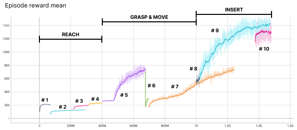

# Appendix

## Curriculum 

Reach:
1. Minimize distance between palm and object (without moving the latter) while encouraging max. hand aperture.
2. Minimize distance between palm and object and additional bonus for contact between hand and object.

Grasp & move:
3. Minimize distance between target position (x,y: initial object - z: 40 cm) while encouraging the contact between fingertips and objects.
4. As step 3. but fixing the z-target position (x,y: initial object - z: initial object + 40 cm)
5. As step 4. but needed to restart
6. We changed the target position from initial object to the final position but keeping the z-target position 40 cm above the z-goal position. We modified the hyperparameter of the target box (from phase 1 to phase 2). Additionally, we modified the reward component by giving more weight to palm distance over fingertip distance and introducing action regularization.
7. As step 6. but we fixed the key_frame id and trained for longer time

Insert:
8. We included the solved component in the reward.
9. As step 8. but needed to restart
10. Enlarge the hyperparameter object space to achieve a more robust policy

All the trained models, environment configurations, main files, and tensorboard logs are all present in the [output/trained_agents](../output/trained_agents) folder. 

## Architecture and algorithm

We use [RecurrentPPO from Stable Baselines 3](https://github.com/Stable-Baselines-Team/stable-baselines3-contrib/blob/c75ad7dd58b7634e48c9e345fca8ebb06af3495e/sb3_contrib/ppo_recurrent/ppo_recurrent.py) as our base algorithm with the following architecture for both the actor and the critic with nothing shared between the two:

obs --> 256 LSTM --> 256 Linear --> 256 Linear --> output

All the layers have ReLU activation functions and the output, of course, is the value for the critic and the 39-dimensional continuous actions for the actor.