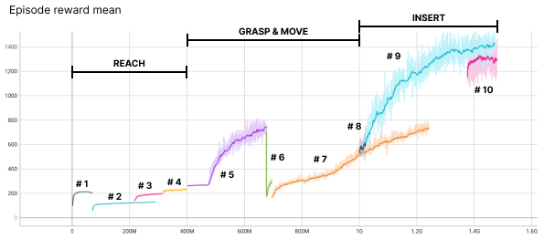

 Summary of our approach

## Key components of the final model

1. On-policy learning with Recurrent PPO
2. Exploration with LATTICE to exploit correlations in the action space
3. Curriculum learning to guide and stabilize training throughout
4. Enlarging the hyperparameter space to achieve a more robust policy

### 1. Recurrent LSTM layers

The first key component in our model is the recurrent units in both the actor and critic networks of our on-policy algorithm. The first layer in each was an LSTM layer, which was crucial to deal with partial observations not only because the environment had no velocity or acceleration information, but also because the actions have really long-term consequences - effects of actions last dozens of timesteps after it has been originally executed.

### 2. Exploration with LATTICE

The second key component we used was LATTICE, a new exploration strategy developed by our team. By injecting noise in the latent space, LATTICE can encourage correlations across actuators that are beneficial for task performance and energy efficiency, especially for high-dimensional musculoskeletal models with redundant actuators. Given the complexity of the task, LATTICE allowed us to efficiently explore the state space.

### 3. Curriculum learning

Third, we used a curriculum of training that gradually increased the difficulty of the task. For both phase 1 and phase 2, we used the same training curriculum steps:

- Reach. Train the agent to minimize the distance between the palm of the hand and the object position. This step could be splitted in substeps such as minimizing first the x-y distance by encouraging the opening of the hand (maximizing the distance between fingertips and palm hand) and then minimizing the z distance as well.
- Grasp & move. Train the agent to minimize the distance between the object position and the target position. In this case, the z-target position was set to be at 40 cm higher than the z-final goal position. Additionally, the x-y position can be the same as the initial object position or can equal the final goal position thereby already minimizing the distance to the target 
- Insert. Train the agent to maximize the solved fraction by inserting the object in the box. While solving the task, we kept (with a lower weight) the part of the reward correlated to the grasp curriculum stage to encourage the policy to continuously try to grasp difficult objects.

Directly transferring the policy of phase 1 to phase 2 was not possible due to the introduction of complex objects and targets. Therefore, we repeated the same curriculum steps with a longer training for phase 2 but we encouraged a more diverse and efficient exploration by using LATTICE. The full list of hyperparameters and links to the models are in the appendix.

### 4. Enlarging the hyperparameter space

The final insight we tried to incorporate consisted in enlarging the hyperparameter space to obtain a more robust policy. Indeed, we observed that the policy almost reached convergence but it was struggling with objects at the extrame of the range (e.g. small objects). To this end, we made the task harder by increasing the range of shape, friction, mass object hyperparameters. Since part of the reward still consisted to grasp the object and lead it on top of the box, it allowed the policy to continue maximing the task performance while learning to grasp objects at the "extreme" of the hyperparemeter space.
 
For the very final submission that scored 0.343, we used our final robust policy that can be found [here](../output/trained_agents/curriculum_step_10/).

## Appendix

### Curriculum 

Reach:
1. Minimize distance between palm and object (without moving the latter) while encouraging max. hand aperture.
2. Minimize distance between palm and object and additional bonus for contact between hand and object.

Grasp & move:
3. Minimize distance between target position (x,y: initial object - z: 40 cm) while encouraging the contact between fingertips and objects.
4. As step 3. but fixing the z-target position (x,y: initial object - z: initial object + 40 cm)
5. As step 4. but needed to restart
6. We changed the target position from initial object to the final position but keeping the z-target position 40 cm above the z-goal position. We modified the hyperparameter of the target box (from phase 1 to phase 2). Additionally, we modified the reward component by giving more weight to palm distance over fingertip distance and introducing action regularization.
7. As step 6. but we fixed the key_frame id and trained for longer time

Insert:
8. We included the solved component in the reward.
9. As step 8. but needed to restart
10. Enlarge the hyperparameter object space to achieve a more robust policy

All the trained models, environment configurations, main files, and tensorboard logs are all present in the [output/trained_agents](../output/trained_agents) folder. 

### Architecture, algorithm, and hyperparameters

#### Architecture and algorithm

We use [RecurrentPPO from Stable Baselines 3](https://github.com/Stable-Baselines-Team/stable-baselines3-contrib/blob/c75ad7dd58b7634e48c9e345fca8ebb06af3495e/sb3_contrib/ppo_recurrent/ppo_recurrent.py) as our base algorithm with the following architecture for both the actor and the critic with nothing shared between the two:

obs --> 256 LSTM --> 256 Linear --> 256 Linear --> output

All the layers have ReLU activation functions and the output, of course, is the value for the critic and the 39-dimensional continuous actions for the actor.

#### Hyperparameters

For Phase 1, we used the following hyperparameters:

| Hyperparameter                             | Value                                                      |
| ------------------------------------------ | ---------------------------------------------------------- |
| Discount factor $\gamma$                   | 0.99                                                       |
| Generalized Advantage Estimation $\lambda$ | 0.9                                                        |
| Entropy regularization coefficient         | 1e-05                                                      |
| PPO clipping parameter $\lambda$           | 0.2                                                        |
| Optimizer                                  | Adam                                                       |
| learning rate                              | 2e-5                                                       |
| Batch size                                 | 512 (sequential) transitions/env $\times$ 64 envs = 128k   |
| minibatch size                             | 2048 (sequential) transitions                              |
| LATTICE exploration                        | False                                                      |
| max grad norm                              | 0.7                                                        |

For phase 2, one of the key changes that we had was the introduction of LATTICE. We initially kept the other hyperaparameters as in Phase 1 with the difference that we finetuned our last policy (starting from ???) by decreasing the learning rate and the entropy regularization:

| Hyperparameter                             | Value                                                      |
| ------------------------------------------ | ---------------------------------------------------------- |
| Discount factor $\gamma$                   | 0.99                                                       |
| Generalized Advantage Estimation $\lambda$ | 0.9                                                        |
| Entropy regularization coefficient         | 1e-05                                                      |
| PPO clipping parameter $\lambda$           | 0.2                                                        |
| Optimizer                                  | Adam                                                       |
| learning rate                              | 2e-6                                                       |
| Batch size                                 | 512 (sequential) transitions/env $\times$ 250 envs = 128k  |
| minibatch size                             | ?? (sequential) transitions                                |
| LATTICE exploration                        | True                                                       |
| max grad norm                              | 0.7                                                        |
